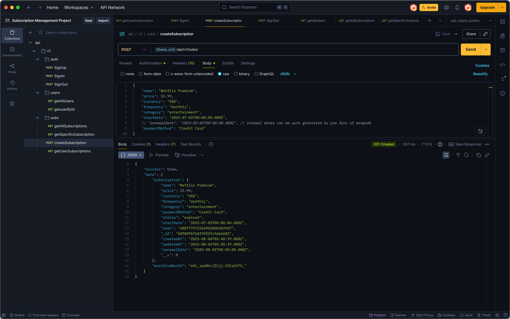

# subscription_management_system

## About the Project
- Built a subscription management system using `Node.js`, `Express.js,` `MongoDB`, `Arcjet`, and `Upstash` Workflows.
- Authenticate users using JWTs, connect a MongoDB instance and integrate it with ORMs.
- Structured the architecture of APIs to ensure scalability and seamless communication with the frontend.

## Tech Stack
1. Node.js
2. Express.js
3. MongoDB
4. Arcjet
5. Upstash

## Project Fratures:
- Advanced Rate Limiting and Bot Protection: with Arcjet that helps you secure the whole app.
- Database Modeling: Models and relationships using MongoDB & Mongoose.
- JWT Authentication: User CRUD operations and subscription management auth via cookies.
- Global Error Handling: Input validation and middleware integration.
- Logging Mechanisms: For better debugging and monitoring.
- Email Reminders: Automating smart email reminders with workflows using Upstash.
and many more, including code architecture and reusability.

## Studying

### Backend Architectures

#### 1. Monolithic architecture
- All components of your app are combined into a single unified codebase
- Hence the backend handles everything from user management to business logic and database interactions.
- Pros:
    - simple to develop and deploy
    - Easier to debug since everything is in one place
- Cons:
    - can get messy as the app grows
    - scaling specific parts of the app can be tricky
- it has been the go-to  architecture for several years, and is also used in this project

#### 2. Microservices architecture
- The entire app is broken down into smaller independent services,
- Each services handle a specific business function (eg: auth, payments, notifications), all separated
- They communicate via
- Ideal for very larges scale systems and enterprise systems where there is demand for scalaibility and flexibility

#### 3. Serverless architecture
- it lets you write your application code without worrying about the underlying infrastructure.
- services like AWS, Vercel now handle provisioning, scaling, and server management for you
- have used a lot of this for my Next.js projects (all deployed to vercel)
- their ideal for startups, rapid prototyping and spiky traffic (cause of the several architecture, the load of the server can bear can be increased easily)


## Project Plan:
1. Setting up a monolithic backend
2. Framework Node.js and Express.js
3. Connecting to MongoDB database
4. Securing API with Arcjet
5. Automating Subscription tracking with Upstash Workflows

## ScreenShots





## Important Commands
- To generate a express project (for only backend)
```bash
npx express-generator --no-view --git ./
```
- To start server
```bash
npm run dev
```
- To start upstash serverless workflow (for local dev)
```bash
npx @upstash/qstash-cli dev
```
